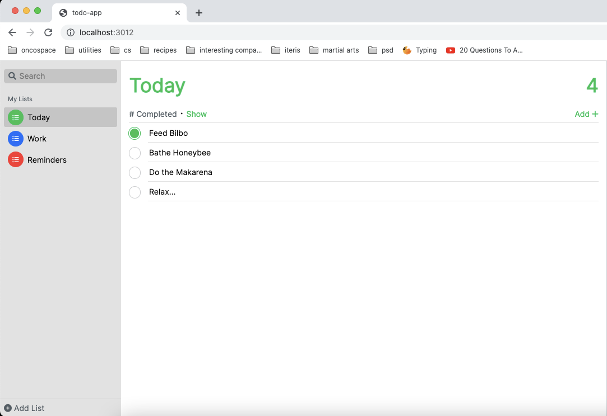

# Loki.js
A humble library for building SPAs

## Features
1. Create well-defined interfaces for your components
2. Automatically instantiate child components from a parent
3. Put your html, css and js all in one place
4. Define events for your loki components
4. Multiple loki apps on one page!
5. A handy-dandy cli!

## View The Demo

To run the demo project, first git clone this repository.

```bash
git clone https://github.com/skapoor8/loki
```

Then navigate to the demo directory:

```bash
cd demo
```

Run the LokiReminders project:

```bash
npx loki serve
```

You should see a working clone of the iOS reminders app.



## Getting Started
Create a new directory for your project, and then create a npm package.
```bash
npm init
```

Install loki
```bash
npm i @skapoor8/loki
```

To create a new loki project
```
npx loki new <app_name>
```

To serve
```
npx loki build
npx loki serve
```

## The Basics

### Components

The basic functionality supported by components includes
1. Templating 
2. Styling
3. 

Create components as follows:

```javascript
  import Loki from '@skapoor8/loki';
  import { ExampleService } from '../some/path';
  import ExampleChildComponent from '../some/path';

  class ExampleComponent extends Loki.Component {
      // define a component selector here 
      static selector = 'example-selector';

      // register subcomponents that will be initialized in the component's 
      // template here
      static components = [
          ExampleChildComponent
      ];

      // any events that you wish to emit must be registered here
      static events = ['click'];

      // any services to be injected can be registered here
      static services = {
          exampleService: ExampleService
      };

      /*
      * A components template goes here. Attach event handlers as shown below 
      * for the click event. The templating language is EJS.
      */
      render() {
          this.state = {
            list: [1, 2, 3]
          }
          return /* html */`              
              <div class="example-body" (click)="handleClick">
                <h1>Hello, Example!</h1>
                <p>This is an example component, huzzah!</p>
                <% for (item of list) { %>
                  <example-child-component
                    state="<%= item %>"
                  ></example-child-component>
                <% } %>
              </div>
          `;
      }

      /*
      * CSS styling can be added for a component as well. Sass is not supported
      * at this time. Every css rule is automatically prepended with the 
      * component's selector for scoping.
      */
      static style() {
          return /* css */`
            .example-body {
              width: 100vw;
              height: 100vh;
              position: absolute;
              top: 0;
              left: 0;
              background: black;
              color: green;
            } 
          `;
      }

      /*
      * OnInit lifecycle method fires after a component is done rendered
      */
      onInit() {
          // injected services can be used as follows
          const {exampleService} = this.services;
          exampleService.loadData()
      }

      /*
      * OnDestroy fires before an event is unmounted, even if temporarily while 
      * being 
      */
      onDestroy() {
          // ...
      }

      // api ---------------------------------------------------------------------
      someMethod() {
        // setState may be called to re-render the comoponent with an updated
        // state
        this.setState({list: [1, 2, 3, 4, 5]});
      }

      // event handlers ----------------------------------------------------------

      async handleClick() {
          console.log('clickity click!');
          this.emit('click', e);
      }
  }

  export default TodoList;

```

### Services

Loki implements a simple DI system, whereby services that inherit from Loki.Service will be injected at the highest level in the component subtree from where they are first registered via the services static property on components.

Services implement lifecycle methods onLoad and onUnload to handle any data loading and cleanup.

Services also provide a static services property to allow them to inject other services, or data stores.

### Store

Using a 3rd party library is the recommended way of handling reactivity in a Loki App. However, a simple data store is provided as well. Create a data store as follows:

```javascript
  import Loki from 'loki';

  export class UIStore extends Loki.Store {

    /*
    * Initialize the state of your store here
    */
    init() {
      this.payloads = {
        selectedListId: null,
        listSummaries: [],
        selectedListSummary: null,
        itemSummaries: [],
        addedItemId: null,
      }
    }

  }
```

To use a store, inject it in a component or a service. To publish values to a store property, use the pub api.

```javascript
  myStore.pub('propName', propVal);
```

To react to updates in store properties, use the sub api.

```javascript
  const sub = myStore.sub('propName', (propVal) => {
    // do something
  }, skipFirst);

  // you can unsubscribe when the subscription should stop running
  // to prevent memory leaks
  sub.unsubscribe()
```

skipFirst is a boolean value, which is true if omitted. This means, be default, store subscriptions do not run with an initial value, akin to RxJS subjects. Passing a true value instead of skip first will make the subscription behave like an RxJS Behavior Subject, i.e. the subscription will fire with the properties initial value.


## Notion Project

[Loki](https://www.notion.so/dustandsepia/Loki-8788e93f626244a39e9c5f44ba1bd7e8)
